> 本人用的电脑是mac，以下所有的环境搭建都是基于mac来配置。

## Terminal(Iterm2)

mac原生的terminal可玩性不高，故改用[Iterm2](https://iterm2.com/)。

官网下载iterm2安装后，进行如下配置：

### Status bar

首先在默认的profile中配置开启status bar。位置：settings>Profiles>Default>session

勾选开启**status bar enabled**，并配置你想要的status bar功能。

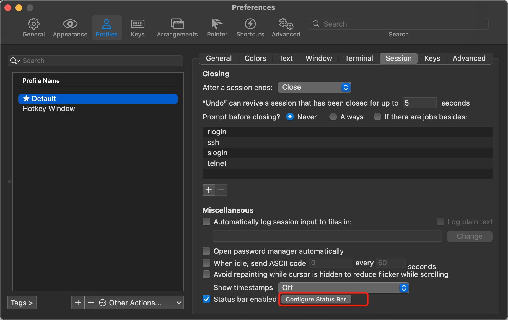

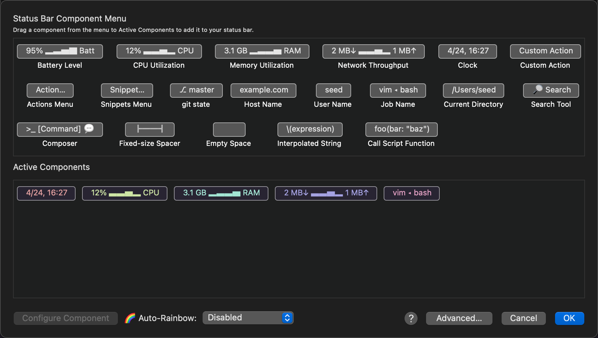

调整status bar的出现位置为iterm2的底部

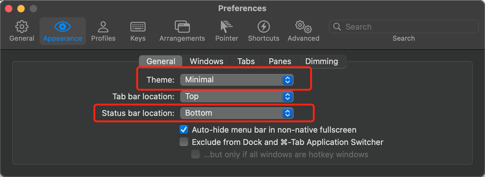

效果如下：

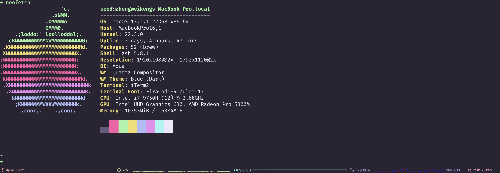

### 主题

为iterm2选择一个主题。官方提供了非常多的内置主题，在settings>Profiles>Default>Color Presets

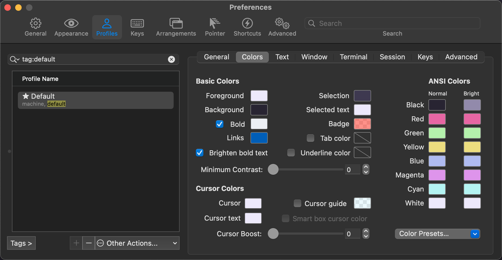

也可以选择第三方的主体，我使用了一个叫[hardhacker](https://github.com/hardhackerlabs/theme-iterm2)的主题。参考文档安装即可。

### 触发器

为了让terminal界面有更丰富的配色，对于一些特殊的字符能有明显的颜色提醒，我还配置了触发器。

例如针对打印日志时，出现error的日志，用红色标明整行。对于info日志，用绿色提示关键字等等。效果如下：

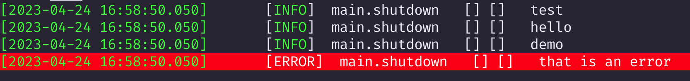

配置方法，在settings>Profiles>Default>Advanced处，编辑Triggers。

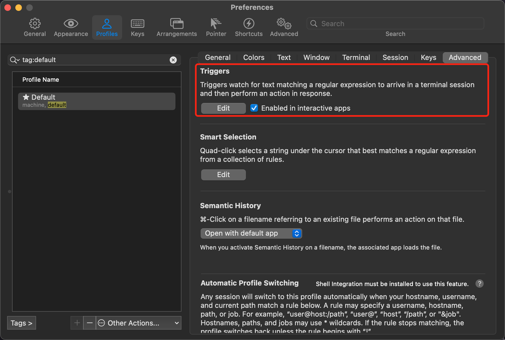

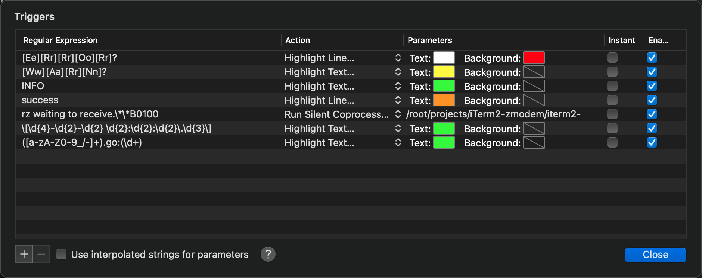

### 配置不同的Profile

之前的配置都是在默认的（Default）的Profile下进行的，但是有时我们会需要有不同的Profile来实现不同的需求。我这里的场景如下：

1. 新开一个terminal后自动登录服务器（例如跳板机）
2. 登录服务器后，自动登录数据库

#### 自动登录服务器

##### 场景一：采用公钥免密登录

需要先将ssh的公钥配置到目标服务器（假设为10.0.0.1，用户名为root），terminal验证下：

```bash
ssh root@10.0.01
```

成功免密登录即可配置iterm2。

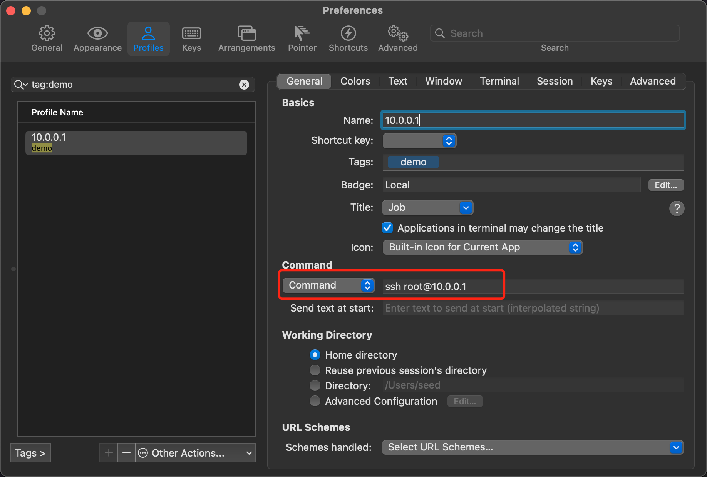

接下来即可在iterm2中快速使用这个profile，且会自动登录目标服务器。

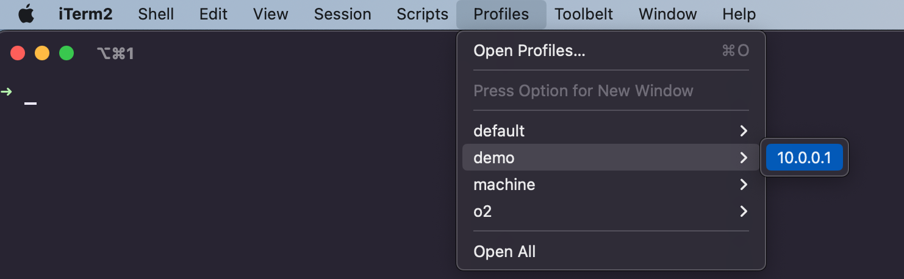

##### 场景二：采用私钥登录

如果目标服务器需要使用指定私钥（假设存放在本地的/root/cert/private.pem）来登录，则对应的iterm2配置如下：

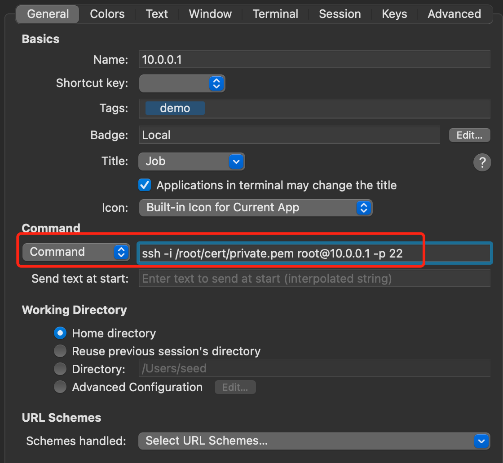

##### 场景三：采用密码登录

如果目标服务器需要使用指定的密码登录（假设密码为abcd123，用户为root），但是ssh不支持显示的密码指令，我们可以使用触发器来实现自动填入ssh密码。

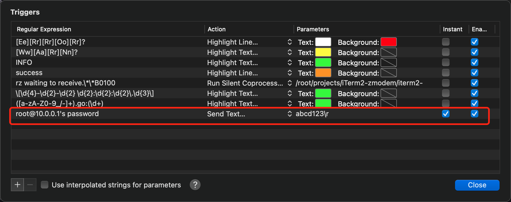

注意触发器配置密码的时候，需要加上`\r`，是回车的意思，这样ssh就会自动输入密码且完成回车确认。另外这里记得勾上触发器的instant。

然后同理在iterm2参考场景一配置Command即可。


#### 登录服务器后自动登录数据库

假设我们希望登录服务器后，自动登录mysql数据库（例如数据库地址为192.168.10.1，用户名为demo，密码为abcDemo，端口为3306），这样我们不需要每次自己登录服务器后还要人工去登录。

#### 场景一：直接登录数据库的方式


#### 场景二：需要进入另一台服务器再登录数据库

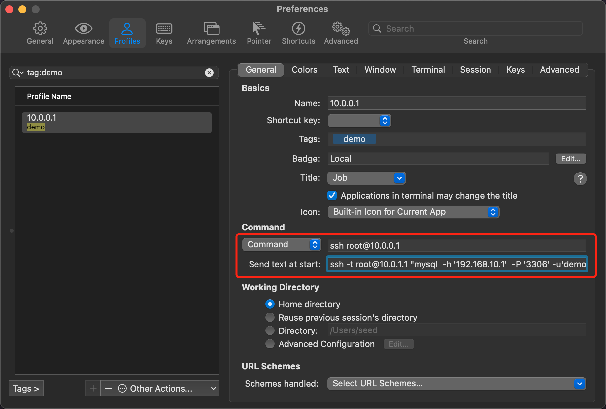

这里需要注意两点：

1. ssh后面需要跟上-t
2. 如果数据库的密码包含`!`，则需要用反斜杠转义后用双引号包裹
   ```bash
   ssh -t root@10.0.1.1 "mysql  -h '192.168.10.1'  -P '3306' -u'demo' -p'abcDemo"\!"' --default-character-set=utf8 -D test"
   ```

### 小结

iterm2的可玩性还是挺高的，例如在使用了主题后，对部分颜色不满意还可以自行调整。也可以给terminal配置背景图片，调整透明程度等等，自己根据喜好调整即可。后面自己有新的玩法时，再继续补充该文。

## shell(zsh)

我采用的shell为zsh，mac已经默认为用户装了该shell，我们可以通过以下命令确认是否安装了zsh，并将其设置为默认的shell。

```shell
$ zsh --version
$ chsh -s $(which zsh)
$ echo $SHELL
```

### oh my zsh

oh my zsh是一款开源的用于管理zsh配置的框架，通过它我们可以实现很多非常便利的zsh扩展功能。安装方式参考[官方文档](https://github.com/ohmyzsh/ohmyzsh/wiki)即可。

### 主题

我们依旧可以zsh选择一套主题，oy my zsh社区有非常丰富的[内置主题](https://github.com/ohmyzsh/ohmyzsh/wiki/Themes)。同样的，我们也可以选择其他第三方主题，这里我选择的是[spaceship](https://github.com/spaceship-prompt/spaceship-prompt)，它可以为zsh定制个性化的提示符，让我们的terminal展示的信息更加丰富。

spaceship安装方式很简单：

```shell
$ git clone https://github.com/spaceship-prompt/spaceship-prompt.git "$ZSH_CUSTOM/themes/spaceship-prompt" --depth=1

$ ln -s "$ZSH_CUSTOM/themes/spaceship-prompt/spaceship.zsh-theme" "$ZSH_CUSTOM/themes/spaceship.zsh-theme"
```

修改将`~/.zshrc`文件的主题配置项，`ZSH_THEME="spaceship" `。

```shell
$ source ~/.zshrc
```

在这里，我根据我的个人需求，修改了spaceship的默认配置，在`~/.config/spaceship/spaceship.zsh`中增加如下配置：

```
# 不展示docker信息
SPACESHIP_DOCKER_SHOW=false

# 展示golang版本信息
SPACESHIP_GOLANG_SHOW=true
# 同步读取golang版本信息（默认为异步）
SPACESHIP_GOLANG_ASYNC=false
```

看下最终效果：

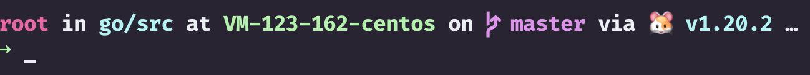

### 插件

oy my zsh社区为zsh提供了非常丰富的插件，可以参考[社区插件文档](https://github.com/ohmyzsh/ohmyzsh/wiki/Plugins)，我选择安装了如下插件：

1. [git](https://github.com/ohmyzsh/ohmyzsh/tree/master/plugins/git)：为git提供了许多别名功能，例如`gst=git status`。
2. [zsh-autosuggestions](https://github.com/zsh-users/zsh-autosuggestions)：它会在你打字时根据历史记录和完成情况建议命令。
3. [autojump](https://github.com/ohmyzsh/ohmyzsh/tree/master/plugins/autojump)：用于快速跳转进历史中曾cd进去过的目录，不需要输入该目录的详细路径。
4. [golang](https://github.com/ohmyzsh/ohmyzsh/tree/master/plugins/golang)：为go提供了许多别名功能，例如`gob=go build`。
5. [gitignore](https://github.com/ohmyzsh/ohmyzsh/tree/master/plugins/gitignore)：可以用于生成gitignore文件。
6. [zsh-syntax-highlighting](https://github.com/zsh-users/zsh-syntax-highlighting)：可以高亮terminal中的shell关键字。

## 总结

以上就是我对我的开发机做的基本的配置，后面想到其他的配置时再继续补充。