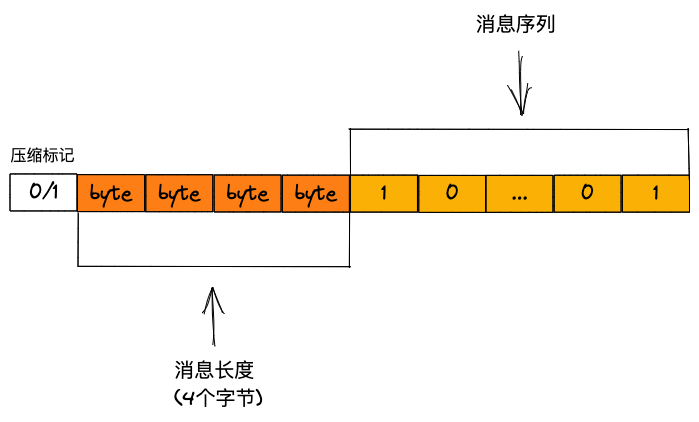

之前已经写过grpc的使用，以及HTTP2的介绍，可以参考如下链接：
* [基于Go语言的gRPC 使用指北](https://zhengweikeng.github.io/seed-blog/posts/grpc-go-technology/)
* [一文说透HTTP2](https://zhengweikeng.github.io/seed-blog/posts/one-blog-to-know-http2/)

因此本文则默认为你已经了解如何使用grpc来搭建服务与完成服务间的通信，来重点介绍grpc的底层原理。

## protocol buffers的编码
我们知道grpc是使用protocol buffers协议作为它的接口定义语言（IDL），并转换成对应语言的源代码，最终由该语言的源码进行编码作为网络传输，而这个编码的规则也是协议定义好的，所以我们有必要来了解下protocol buffers是如何进行编码。

我们以下面一个protocol buffers定义为例子：

```protobuf
message User{
	string name=1;
}
```

这里我们定义了一个简单的message，其中有一个字段类型为string的字段name。

该协议最终会被编码成如下结构的字节流：


也就是说每个字段的定义都会被分为两部分，标签和值。

其中标签的值需要由以下两部分组成：
1. 字段索引（field index）
2. 线路类型（wire type）

字段索引，顾名思义就是我们定义字段时最右侧的那个索引值。

而线路类型则会根据字段类型来进行定义，它被用来确定值的长度。

首先，我们来看下线路类型和字段类型的映射关系：

| 线路类型 | 分类         | 字段类型                                                 |
| -------- | ------------ | -------------------------------------------------------- |
| 0        | Varint       | int32、int64、uint32、uint64、sint32、sint64、bool、enum |
| 1        | 64位         | fixed64、sfixed64、double                                |
| 2        | 基于长度分隔 | string、bytes、嵌入式消息、打包的repeated字段            |
| 3        | 起始组       | groups（已废弃）                                         |
| 4        | 结束组       | groups（已废弃）                                         |
| 5        | 32位         | fixed32、sfixed32、float                                                         |

然后会按照如下规则来计算标签的值：

tag value = (field index << 3)  | wire index

也就是说先将字段的索引值左移3位，再将其与对应的线路类型进行按位或操作。

这个也比较好理解，其实就是线路类型占3位，再拼上字段索引。

对应到上述例子，name字段的类型为string，则线路类型为2，对应的二进制为00000010。字段的索引值为1，对应的二进制为00000001。代入以上公式中，则为

tag value = (00000001 << 3) | 00000010 = 00001010

00001010对应的10进制值为10，也就是说name字段的标签值为10。

再来说下上述字节流中的值。在protocol buffers中，会根据字段的类型选择不同的编码方式。

目前protocol buffers采用的字段编码技术有：
* Varint，即可变长度整数，使用了单字节或多字节来序列化整数的方法，值越小的数字，使用的字节数越少，这样对空间的占用也得到减少。例如一个int32类型的数字，一般是需要4个字节来存储的，但是对于很小的数字，像1、10、100这些，甚至1个字节就足够存储。
* 固定字节类型
	* 64位类型，如fixed64、sfixed64、double
	* 32位类型，如fixed32、sfixed32、float
* 字符串类型，会使用UTF-8来进行编码，这个就不做过多介绍了，网上资料也有很多

好了，了解了protocol buffers采用的字段编码技术，根据之前的例子，假设name字段的值是Jack，则对应的utf-8编码值为`\x4A\x61\x63\x6B`，此时protocol buffers会用如下16进制编码来表示：

```
A 04 4A 61 63 6B
```

其中04说明了编码后的字符串值的长度。

最后将编码后的标签和值连接到之前说的字节流中即可，流结束时会以0作为结尾。

## 消息分帧
知道了消息是怎么编码的，接下来看下消息最终的数据结构。



第一个字节表示压缩标记，用来表示是否进行了压缩。

接下来的4个字节，用来表示消息的具体长度，需要注意的是，这里会采用大端（big-endian）的格式来表示。4个字节来记录长度，也就说明gRPC可以处理大小不超过 4GB 的消息。

注：大端是一种在系统或消息中对二进制数据进行排序的方式。在大端格式中， 序列中的最高有效位(2 的最大乘方)存储在最低的存储地址上。

之后的字节就是具体的消息数据了。

以上这种消息分帧的技术我们称为 **长度前缀分帧(length-prefix framing)** 的消息分帧技术。

## HTTP/2
grpc会采用HTTP/2作为其网络传输协议，关于HTTP2这里就不解释了，可参考开头处给出的链接。


## 参考资料
* [详解varint编码原理](https://juejin.cn/post/6844903953327456263) 