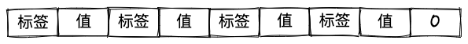

之前已经写过grpc的使用，以及HTTP2的介绍，可以参考如下链接：
* [基于Go语言的gRPC 使用指北](https://zhengweikeng.github.io/seed-blog/posts/grpc-go-technology/)
* [一文说透HTTP2](https://zhengweikeng.github.io/seed-blog/posts/one-blog-to-know-http2/)

因此本文则默认为你已经了解如何使用grpc来搭建服务与完成服务间的通信，来重点介绍grpc的底层原理。

## protocol buffers的编码
我们知道grpc是使用protocol buffers协议作为它的接口定义语言（IDL），并转换成对应语言的源代码，最终由该语言的源码进行编码作为网络传输，而这个编码的规则也是协议定义好的，所以我们有必要来了解下protocol buffers是如何进行编码。

我们以下面一个protocol buffers定义为例子：

```protobuf
message User{
	string name=1;
}
```

这里我们定义了一个简单的message，其中有一个字段类型为string的字段name。

该协议最终会被编码成如下结构的字节流：



也就是说每个字段的定义都会被分为两部分，标签和值。

其中标签的值需要由以下两部分组成：
1. 字段索引（field index）
2. 线路类型（wire type）

字段索引，顾名思义就是我们定义字段时最右侧的那个索引值。

而线路类型则会根据字段类型来进行定义，它被用来确定值的长度。

首先，我们来看下线路类型和字段类型的映射关系：

| 线路类型 | 分类         | 字段类型                                                 |
| -------- | ------------ | -------------------------------------------------------- |
| 0        | Varint       | int32、int64、uint32、uint64、sint32、sint64、bool、enum |
| 1        | 64位         | fixed64、sfixed64、double                                |
| 2        | 基于长度分隔 | string、bytes、嵌入式消息、打包的repeated字段            |
| 3        | 起始组       | groups（已废弃）                                         |
| 4        | 结束组       | groups（已废弃）                                         |
| 5        | 32位         | fixed32、sfixed32、float                                                         |

然后会按照如下规则来计算标签的值：

tag value = (field index << 3)  | wire index

也就是说先将字段的索引值左移3位，再将其与对应的线路类型进行按位或操作。

对应到上述例子，name字段的类型为string，则线路类型为2，对应的二进制为00000010。字段的索引值为1，对应的二进制为00000001。代入以上公式中，则为

tag value = (00000001 << 3) | 00000010 = 00001010

00001010对应的10进制值为10，也就是说name字段的标签值为10。