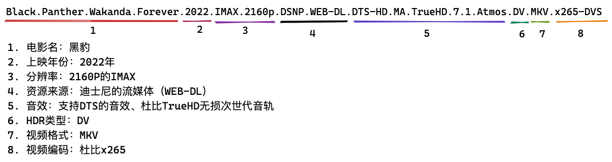

## 前言
如果你平时有下载电影的爱好，尤其是下载高清电影，例如蓝光、4K，那么你下载的电影的文件名很多时候都长下面这个样子：

```
Black.Panther.Wakanda.Forever.2022.IMAX.2160p.DSNP.WEB-DL.DTS-HD.MA.TrueHD.7.1.Atmos.DV.MKV.x265-DVS
```

前面部分是电影的名字我们能够理解，后面那些WEB-DL、DTS-HD、Atmos都是什么意思呢。面对眼花缭乱的参数，我们怎么判断我们需要下载哪一种。本文就是来梳理关于电影文件名这块的一些概念，给自己后面再下载电影的时候提供判断的依据。

## 文件名含义
先来翻译下上面给出的示例的文件名：



前两部分容易理解，我们从第三部分开始来详细解释。

### 分辨率
这个我们很熟悉，从以前的720P、1080P到现在的2160P，相信你下载高清电影第一个追求的就是这个指标，分辨率越大，自然文件占用的空间就越大。

* 2160P：4K
* 1080P：Full HD
* 720P：HD
* 480P：SD

如果你现在正在使用4K电视，推荐首选2160P；

### 资源来源
常见的电影资源来源有：
* Blu-ray disc（Blu－ray、BD）：蓝光原盘，对正式出版的蓝光影碟的数字拷贝，分辨率能够达到1920×1080格式的影片。蓝光原盘BD必须是原版的数据拷贝，不得对原版的数据和结构进行任何的增删或者改动。视听体验的巅峰，唯一的缺点就是大，一个电影动辄50G。
* BluRay-REMUX：是以蓝光碟片源，去掉蓝光碟内不需要的花絮和音轨压制而成，一般来说对片源和主要音轨没有压制，所以整体码率可达80Mb左右，内涵的音轨也是无损次世代环绕。
* BDRIP（BRRIP）：即Blue-ray Disc Rip，蓝光高清压制，这个情况就比较多。根据压制组的特色，码率从几兆到几十兆都有，大家可以根据电影文件大小来判断。
* WEB-DL（即web download的意思）：片源来自Netflix、Disney、HBO-MAX等海外流媒体平台，有时前面会标明来自哪个流媒体，例如上述的DSNP（Disney迪士尼平台），最高码率可达17Mb左右，一部2小时的电影体积在15GB以上，音轨则以杜比全景声为主（ddp内核）
* WEBRip，从视频网站下载后或录屏后，重新压制。理论上无法通过web-dl即网站下载获取视频的时候，需要用录屏软件、采集卡对视频网站录屏后重新压制。部分人会对web-dl下载下来的视频进行压制，体积会更小一点。
* HD：指HDTV（Hign Definition Television），翻译成中文是「高清晰度电视」的意思，网上下载的高清影片，如果写着HD高清版，那么它的来源就是HDTV，就是从高清电视信号录制而来的，因此有时候画面上会有电视台的台标。
* HR-HDTV：Half Resolution High Definition，半高清度电视。是用DivX/XviD/x264等MPEG4压缩技术对HDTV的视频图像进行高质量压缩,然后将视频、音频部分封装成一个.avi或.mkv文件，最后再加上外挂的字幕文件而形成的视频格式。 画面清晰度更高。
* CAM：就是我们所谓的枪版，基本手持摄像机偷录，镜头各种抖动，各种人头晃动，现场人。CAM 通常是用数码摄像机从电影院盗录。有时会使用小三角架，但大多数时候不可能使用，所以摄像机会抖动。因此我们看到画面通常偏暗人物常常会失真，下方的字幕时常会出现倾斜。 由于声音是从摄像机自带的话筒录制，所以经常会录到观众的笑声等声音。因为这些因素，图象和声音质量通常都很差。
* TS（TELESYNC）：也是枪版的一种，镜头相对固定，音质较好，不会人员走动 。TS 与CAM版的标准是相同的。但它使用的是外置音源（一般是影院座椅上为听力不好的人设的耳机孔）这个音源不能保证是好的音源，因为受到很多背景噪音的干扰。TS是在空的影院或是用专业摄像机在投影室录制，所以图象质量可能比CAM好。但画面的起伏很大。常出现的有一般TS版和经过修复清晰TS版。

这下你知道如何选择了，最后两种肯定是直接抛弃的了（除非你实在等不及想看枪版）。从选择上肯定就是：BD（Blu-ray disc、BluRay-REMUX）> WEB-DL > HDTV

### 音效
音频编码常见的有：
* DD5.1：最基础的Dolby（杜比） digital 5.1环绕声，一般都是比较老的片子上才会使用
* DDP 5.1：Dolby Digital Plus，如果你有全景声功放或者回音壁的话，已经可以体验全景声效果了。
* DDP 5.1(Atmos)：支持杜比全景声
* TrueHD：杜比TrueHD是无损次世代音轨，码率较高，所以只会出现在蓝光资源中，当文件名中只有TrueHD时，可能可以点亮全景声，也可能只是传统的无损环绕声
* DTS5.1：最基础的5.1环绕声。
* DTS-HDMA：dts版本的无损次世代音轨
* DTSX：dts版本的全景声，中文名叫做临镜音，内核是dts-hdma音轨，所以码率一般都非常高。
* AAC/FLAC/LPCM：AAC编码一般都为立体声（也有部分含多声道），码率从128Kbps到640kbps不等，一般来说看到AAC就说明这部片子视频和音频码率都比较低。在有些片子上，我们还能看到FLAC音轨。FLAC格式在音乐中使用比较多，码率在800Kb左右，播放器解码后其实就是PCM格式。LPCM格式，无损的多声道PCM格式。

### HDR类型
* HDR：高动态范围的意思，简单来讲就是能让画面对比度更大，容纳更多的信息，从而让画面的暗部和亮部细节更加丰富。HDR需要10bit位宽，就会被称为HDR10。
* SDR：相对HDR而言的，一般都是8BIT位宽的片源。
* 动态HDR（DV和HDR10+）：对于静态HDR标准，一部电影使用都是用同一种画面和亮度方案，而杜比视界和HDR10+都是动态HDR标准，每一帧画面都可以用不同的亮度和色彩映射方案。

需要注意一点，
1. 杜比视界在只有播放器和显示设备同时支持杜比视界才能显示正确色彩，不支持时，画面会偏紫偏绿。
2. 绝大多数的投影仪都是最多支持到HDR10，杜比视界和HDR10+都没办法正确播放，
3. 如果你没有支持杜比视界的电视机，最好不要下DV版本，尤其是在电脑上看还不如HDR10的省事

### 视频格式
常见的有：
* mp4：杜比视界为流媒体专用，仅能包含单层DV和有损音轨，兼容性最好
* mkv：该格式杜比视界可以包含FEL或MEL的杜比视界，以及可以包含无损音轨，是为了精简4K UHD原盘ISO用的，可以节省不少空间。对播放的设备和软件有一定要求，不一定所有设备都能播放。

### 视频编码
即视频的压缩算法，常见的有：
* H264（avc）：往往与1080P一同出现，压缩率较低
* H265：4K视频标准编码之一，压缩率比较高(相对于H264来说)，实现相同的清晰度，可能只需要H264一半的码率即可。

## 常用软件
如果想播放高清电影，尤其是4k且包含杜比视界的电影时，则必须使用能够支持这个格式的软件。本节则来介绍下，一些高清电影爱好者常用的软件。

**QuickTime Player**

如果是mac用户，肯定知道这款苹果内置的播放器，这款播放器自身已经非常强大，但是这款播放器能够支持的电影的格式非常的少，连业界常用的MKV都不支持。

从苹果官网对它的描述来看：“播放视频或音频文件，创建和编辑影片，包括屏幕录制和仅音频录制。”估计其定位也是在编辑（简单编辑）一个视频上。

**mpv**

可以在这下载：https://mpv.io/

它是一款开源、免费且非常强大的播放器，且能够支持格式非常多，界面也非常简单。另外也支持定制化，很多人也用它来开发脚本和程序。

**INNA**

下载地址：https://iina.io/

是对开源的mpv的最强实现，但是目前不支持杜比视界，如果自己也没有支持这块的电视作为支撑，可以无脑使用这款播放器。

**movist**

下载地址：https://movistprime.com/

是一款收费的播放器，目前也支持了苹果的M系列芯片。支持HDR、H.265解码，让你能够享受4K。

**Fig Player**

下载地址：https://apps.apple.com/cn/app/fig-player-play-mp4-mkv-mp3/id1612400976?l=en&mt=12

也是一款收费的播放器软件，同样支持4K影视播放，功能也非常丰富，还支持逐帧播放这种其他播放器不具备的功能。

**Infuse player**

下载地址：https://apps.apple.com/cn/app/infuse-video-player/id1136220934?l=en

也是一款收费的播放器软件，同样支持4K影视播放，和Fig Player应该是mac用户最喜欢对比的软件了。

对播放杜比视界的视频，对比如下：
1. Fig Player，播放流畅，颜色也是对的，但是色彩饱和度不高。
2. Infuse，播放卡顿，尤其是快进，但是色彩还原的非常好，饱和度也很好。

很多极客玩家都会使用Infuse结合Apple TV和Nas等设备来做到最极致的影视播放体验。

这里提供一些其他的资料可以参考参考：
* [Fig Player和别的Mac视频播放器有什么区别？](https://zhuanlan.zhihu.com/p/589950513)
* [Apple TV最强4K HDR播放器 infuse Pro，国区如何购买](https://zhuanlan.zhihu.com/p/536545427)

  

